# Personal Website

_Time Estimate: 1 hour_

Note: If you have not set up your workspace, please visit the [Workspace Setup](../workspace_setup/README.md) guide.

## Our Goal

By the end of this guide, you will have created a personal website! Though, it doesn't have to be for you. For example, this is [John Cena’s](http://nguyenbrian.github.io/john-cenas-personal-website/) _\(Turn your sound down!\)_.

Your final product will look similar to this, but we want you to apply as many changes you as wish:

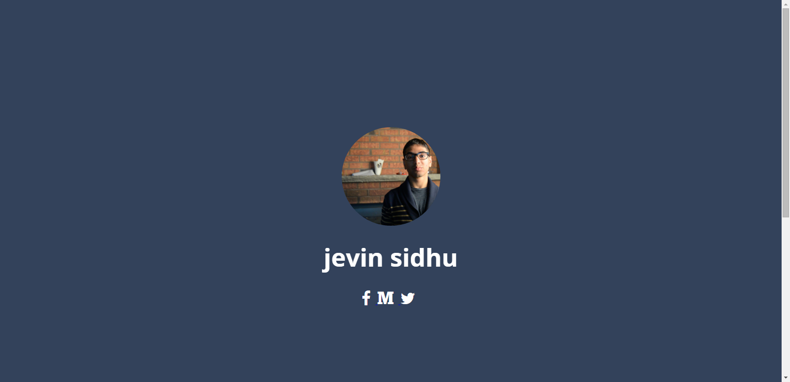

Link to example website: [http://jevinsidhu.github.io/workshop-website/](http://jevinsidhu.github.io/workshop-website/)

Link to final code: [https://ide.c9.io/jevinsidhu/workshop-website](https://ide.c9.io/jevinsidhu/workshop-website)

## What You Will Learn

The basics of two programming languages: [HTML](/guides/DOCUMENTATION.md#html) and [CSS](/guides/DOCUMENTATION.md#css).

## Part One: Importance of Googling

What happens when don't know how to do something? **Google it!**

Professional programmers Google while on the job. The largest Q&A website for programming \([https://stackoverflow.com](https://stackoverflow.com\)\) **has hundreds of questions submitted by programmers everyday** who work at giant tech companies like Apple, Facebook and Google.

When searching: Be **specific, clear and concise**.

Try the first 3 links that appear → Then seek help from friends/co-workers

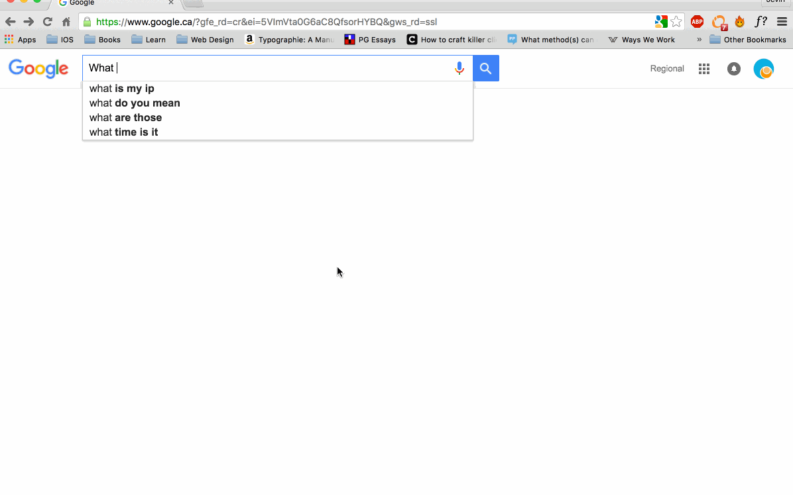

In the case above, Google even gives us the answer for our question, _"What does HTML stand for"_, without having to click anything-- neat!

**Try the same for CSS!**

## Part Two: Log onto Cloud 9

_Note: You should have a Cloud 9 account after following the _[_Workspace Setup_](https://github.com/JevinSidhu/cipher/tree/master/guides/workspace_setup)_ guide!_

1. Head to [https://c9.io](https://c9.io)

2. Open the workspace titled `"cipher-projects"`.

3. It will take a few seconds to load. After it does, you should get a page that looks similiar to this:

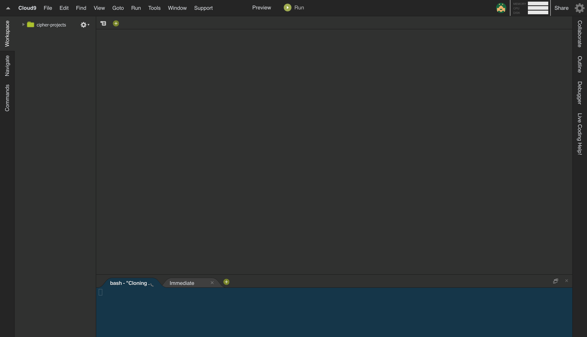

## Part Three: Creating Your HTML File

1. **Right click the left section** where the folder icon is. This area is the directory!

2. Click **“New File”** and name this file `index.html`

   Word files end in .doc → HTML files end in .html. This ending tells the computer that the document is written in HTML

   _index.html_ is the usual name for the main HTML file. In larger projects you may have several files -- for this project we will only have one.

3. **Double click the file, **`index.html`, to open it

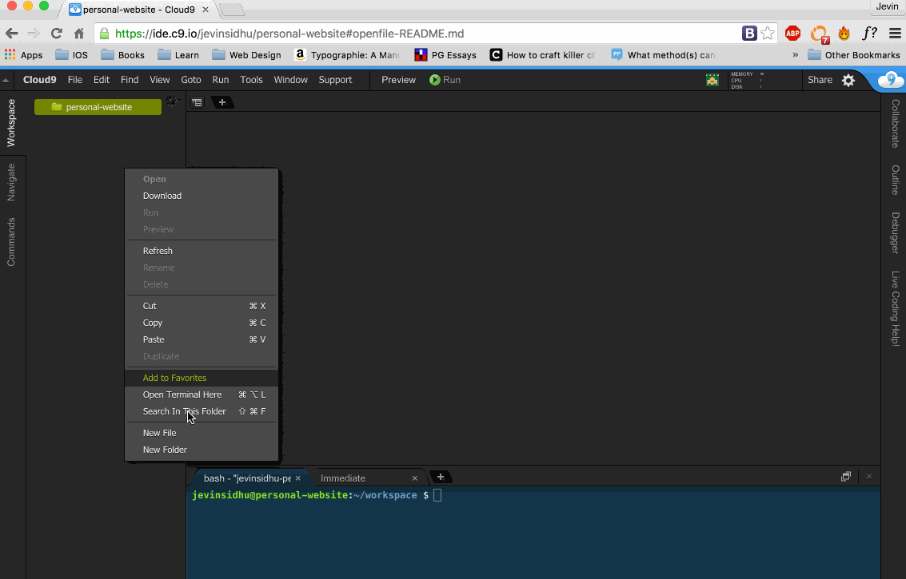

## Part Four: Opening the Preview

1. On the bar on the top, right below my bookmark tab or URL area, **click  the 2nd last tab, **`Preview`**.**

   You want to be able to see the changes you make. With Word, as you type you can see your changes instantly

   With HTML, you need to:

   * Type
   * Save the document
   * View changes on the web

2. Click `Live Preview File`

3. A window on the right side, called the `pane`, will pop up

4. Click the `boxed arrow icon` on the right of the pane to open the web page full screen

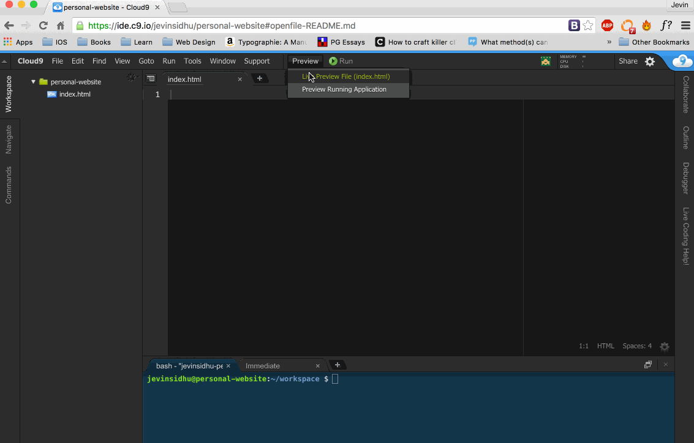

## Part Five: Writing Some Code!

1. Back to the `index.html` file! Let’s write your name and a description!

   **For example:**

   ```
    Jevin Sidhu. 
    My name is Jevin
   ```

2. Save the file by clicking `File` on the top-bar and then `Save` **OR** using the shortcut `CTRL + S/Command + S`

3. Switch to the tab with your `Live Preview` to see your changes!

   You may need to refresh your page because C9 sometimes doesn't auto-refresh in time.

_Note: Notice how adding blank lines between your sentences in HTML does not change what it looks like. We need to style elements by using _`HTML Tags`_._

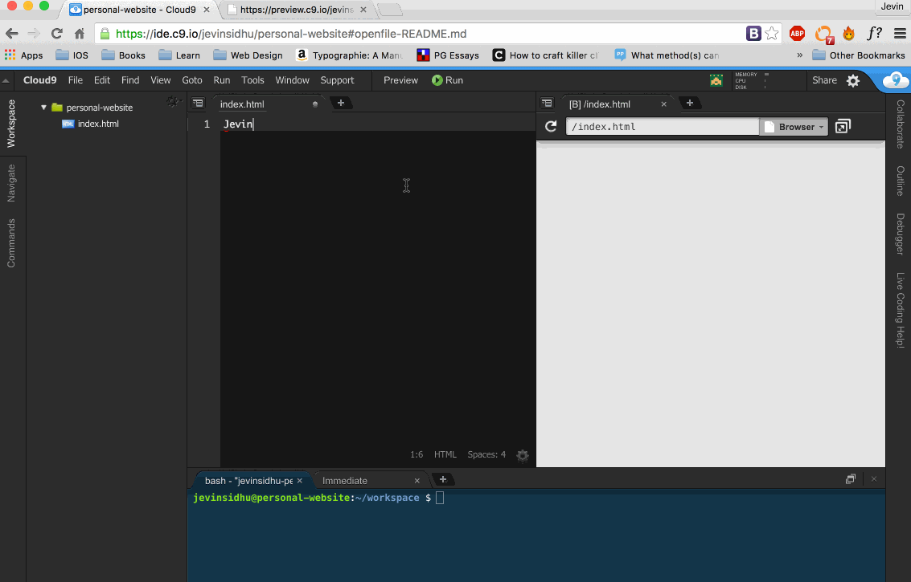

## Part Six: Introducing HTML Tags!

`HTML tags` organize information on a web page.

1. Make your name a `header` by putting it between an **opening and closing heading tag**.

   `<h1> [Your Name] </h1>`

   * `<h1>` is the **opening** `h1 tag`
   * `</h1>` is the **closing** `h1 tag` → The difference is the _forward slash_ before the name `( / )`

   Putting your name between the `h1` tags styles your name with a bigger, bolder font and puts it on a separate line.

   _Almost_ all HTML tags have both an opening and closing tag → The ones that don’t we will discuss.

   

## Part Seven: More about Headings

There are six different headers: `<h1>` through `<h6>`

`<h1>` tag indicates that the text between the opening and closing tags is the **most important**. `<h6>`is the **least important**.  
Therefore, the closer the tag is to h1 numerically, the larger the text!

Try it out!

## Part Eight: Adding an Image

1. To add an image, use the image tag:

   ``

   `img` is the `tag name` → This is self-closing, meaning there is no closing tag, like `</img>`

   `src` is an `attribute` that specifies the URL of the image

   * Add the URL of our image between the quotes
     * Upload an image to [Imgur](http://imgur.com/) or get one from [Google Images](https://images.google.com).
       * To get the URL, right click the image and hit **copy image address**

   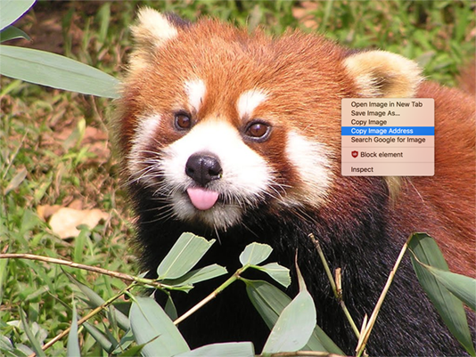

   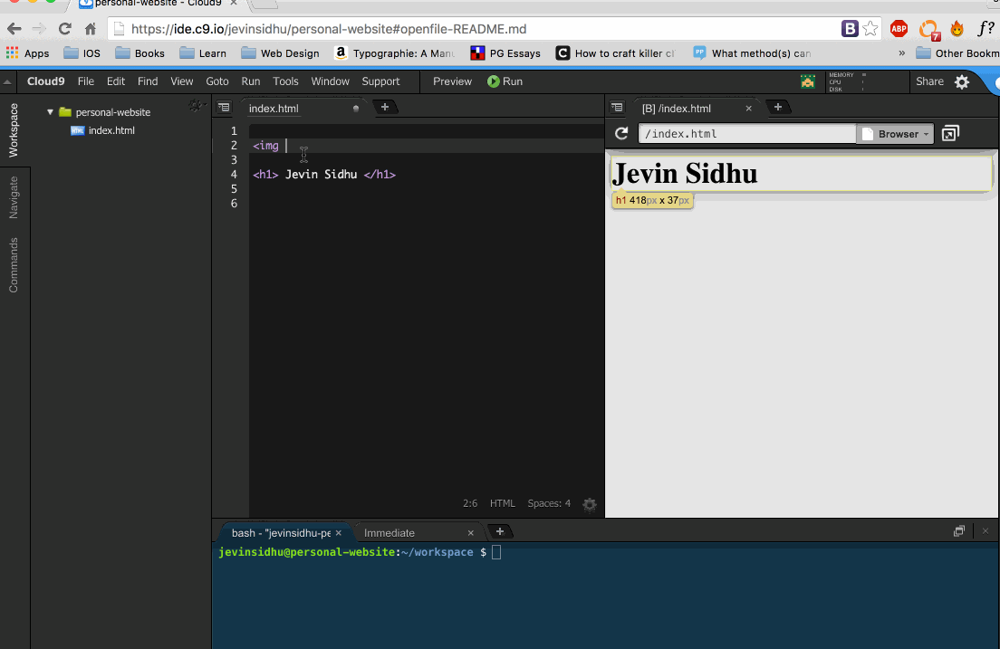

_Note: The web page reads HTML top to bottom. If you put the tag above the text, it will show up above the text. If you put the tag below the text, it will show up below._

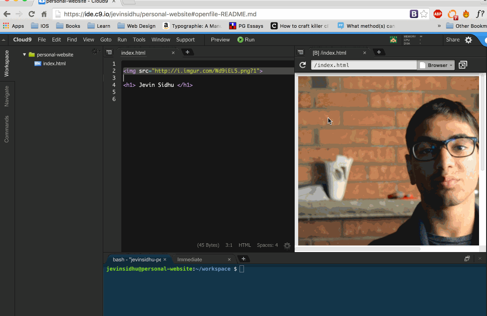

## Part Nine: Introducing CSS

`HTML` is for content

* It is like the [skeleton](https://www.youtube.com/watch?v=WWum0VRc6MI) of a body

`CSS` is used to change the way things look and feel

* It is like the colour, width, height of your face/skin

Therefore, if we want to change the size of the image → Use `CSS`!

**Create a CSS file by:**

1. Right clicking the area to the directory \(left-most section\)

2. Click `New File`

3. Name it by typing: `main.css`  
    The extension acts as an identifier for the computer \(just like `.doc` or `.html`\). `main.css` is the common name for the main CSS file.

4. Double click to open the file

   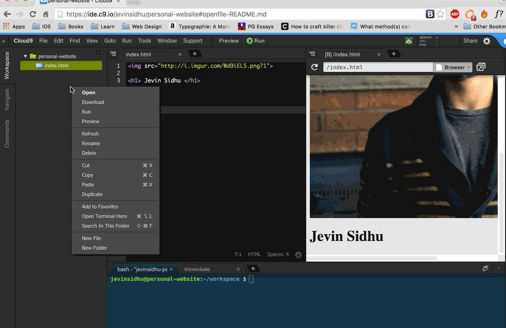

## Part Ten: Adding the Head Tag

1. Let’s hop back to our index.html file by double clicking it

   We need to **tell the web page some information** about our HTML file! None of this information should show up on the webpage itself. I.e. Show up like your name on the page

   To do this: we need to enclose the information in a `<head>` tag

   * Remember to close the tag with closing `</head>` tag → This is **not like the **`img`** tag**
   * C9 closes tags automatically for you, but you may delete it by accident sometimes

2. Write the tag `<head>` and make sure you have the closing tag `</head>`

   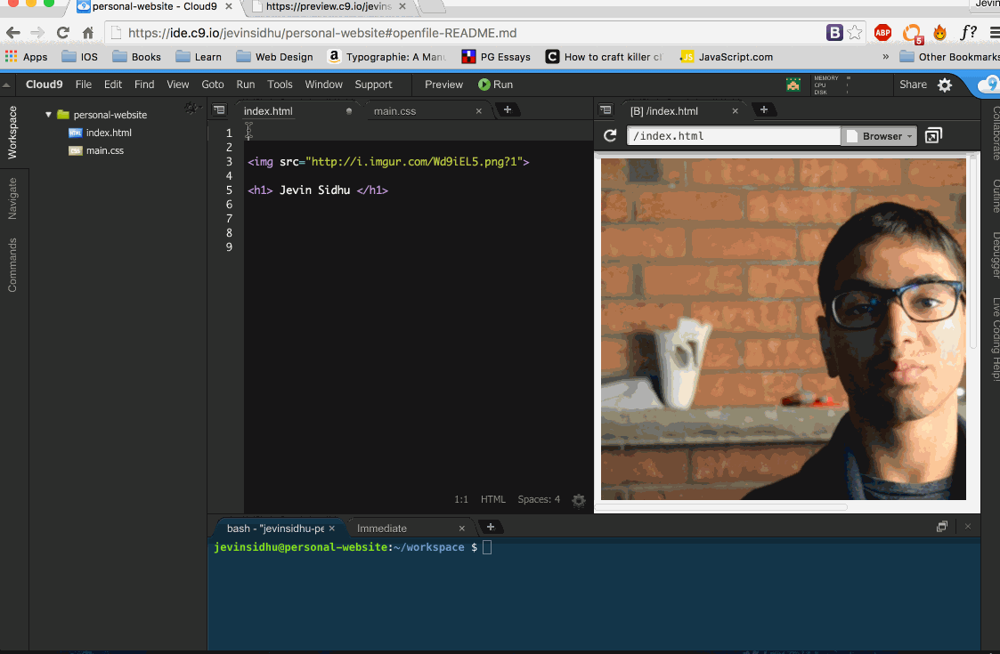

   Computers are dumb; they are powerful because humans program them.

   We have these two files, the HTML file and the CSS file. The computer draws **no** association between the two:

   * We need to specifically tell them → Link these two together so they are connected
   * One thing to note: The head tag serves no purpose other than to be as an organizational tool for us.

## Part Eleven: Linking the CSS file to the HTML

1. Let’s link the HTML and CSS file! You have to add another tag for this.

   The code is: `<link rel= “stylesheet” href=“FILENAME” >`

   * `link` is a tag → it’s self-closing, like the `img` tag, so there is no closing tag \( `</link>` \)

     * This lets the webpage know you are linking something

   * `href` is an `attribute`, like the `src` one for the `img` tag, that specifies the location of a file

   * `rel` is also an `attribute` that tells the HTML what sort of file it is linking to

2. Add the name of the `CSS` file between the quotes → `<link rel= “stylesheet” href=“main.css”>`

   Ensure you include the extension: `.css` → `main.css` NOT just `main`

   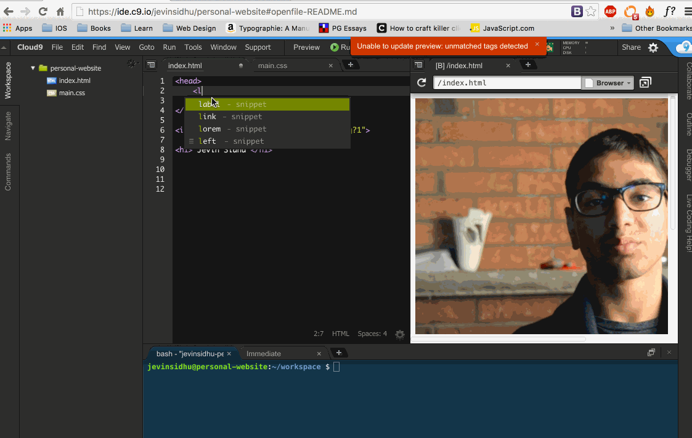

## Part Twelve: Change the Image Size

1. Let’s hop onto the CSS file → Double click the `main.css` file on the right directory

   

2. Before we got side-tracked, we were trying to change the size of our image -- it’s way too big right now

   Let’s write some code to change that in the `main.css` file:

   ```
    img {
      width: 25%;
    }
   ```

   Play around with the value → The lower it is, the smaller the image will become!

   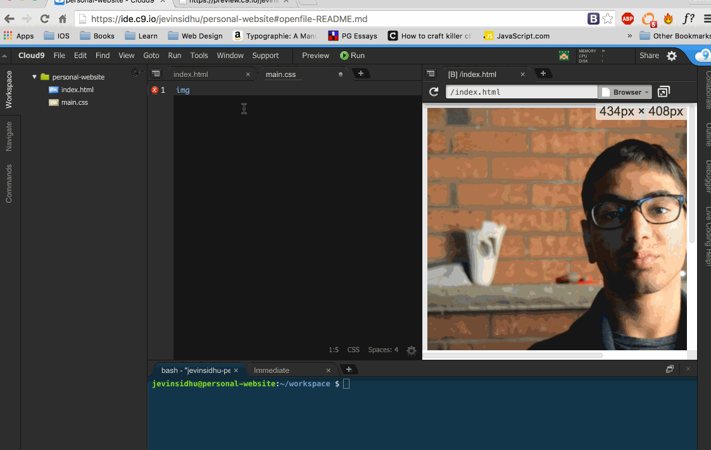

## Part Thirteen: The Breakdown

Let’s break this down into an English sentence:


This is called **pseudo-code** → Code that wouldn’t run on the computer, but we’re making sense of it


For every `` tag on the web page


I want all the style properties inside the curly brackets `({ })` to apply:


specifically, I want the \`width


to be `50%` of the `width` of the page.

## Part Fourteen: Vocabulary


`img` is called the **selector**, it "selects" all of the img tags and applies all of the settings inside of the curly braces `({ })`


`{ }` are called **curly braces**


The name on the **left side of the colon** is called the **property**, in this case it is `width`.


`50%` is what's known as the **value** → End the property + value declaration with semicolon `(;)`. This acts like a period.

## Part Fifteen: Pixels versus Percentage

If you resize the page, the image will adjust to be `25%` of the total view.

If we want the image to stay a constant size → We need to use a different **value type** named `pixels`


1. Set the `width` \(property\) to `200px` \(value\) instead of `25%` \(value\)

   Use `pixels: [number]px` instead of `[number]%` → A pixel is a single point in an image and thousands make up one

   * This specifies how big the image should be no matter the size of the page
   * Remember to end the value `(200px)` with a semicolon `(;)` and close the curly braces `( } )`

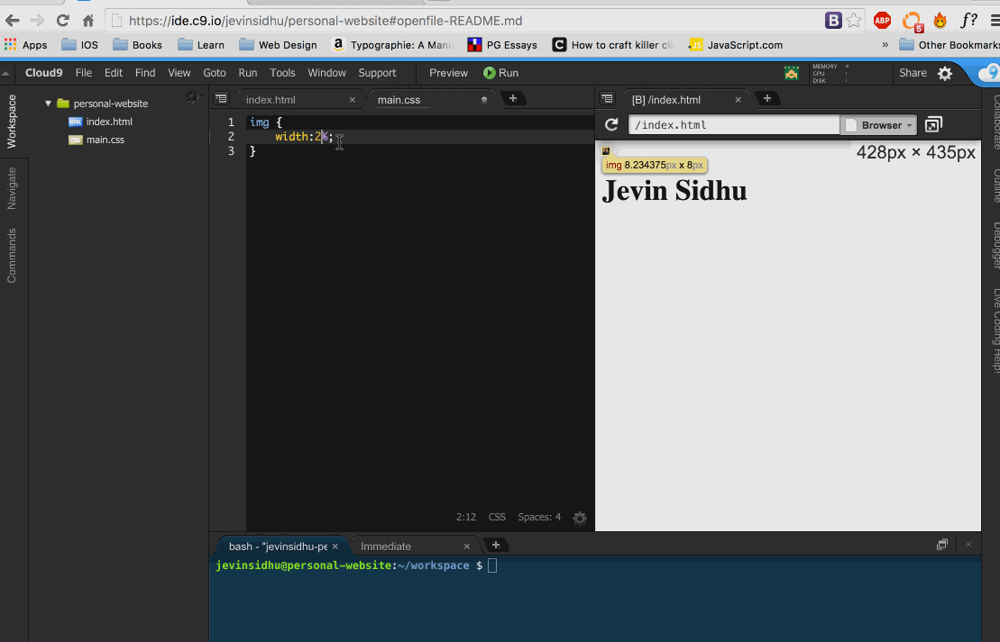

## Part 6teen: Making the Image a Circle

Let’s **Google** how to make our image a circle! → Remember: Be **specific, clear and concise:**

* I Googled: "make image circular in CSS"

This was the first one I found, but if yours wasn’t this one -- don’t stress, it’s most likely still fine!


1. Add: `border-radius: 50%;` → have a **line-break between each property and value with the “enter” key**

   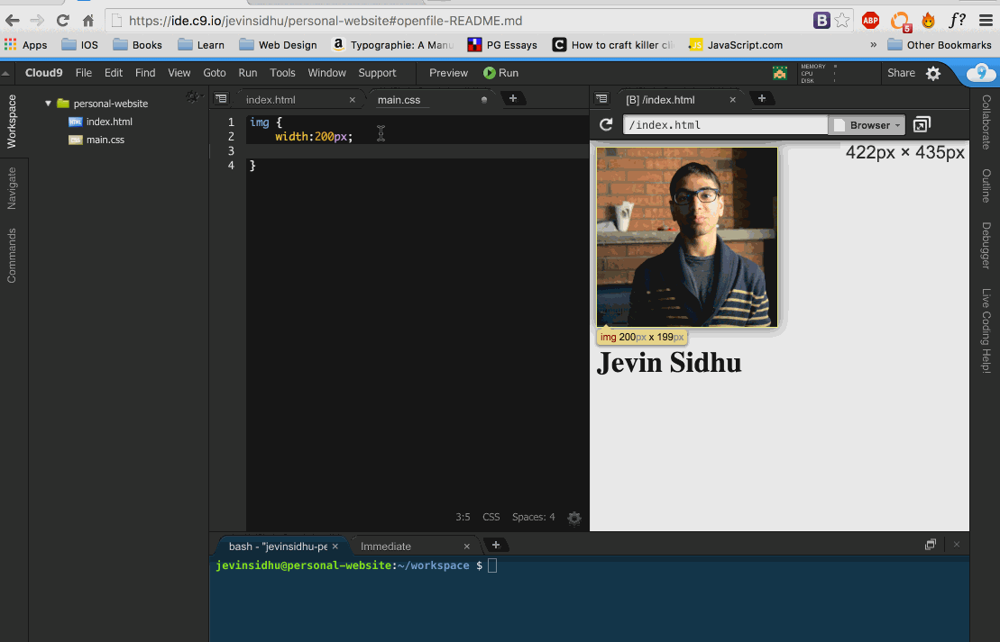

## Part Seventeen: The Body Tag

The tag that usually encloses the main document is: `<body> </body>`

The `<body>` tag contains all the contents of an `HTML` document, such as text, hyperlinks, images, tables, lists, etc → Does not include the `<head>` tag.

1. Create a body section by putting the opening `<body>` tag before your website's visible content begins, and a closing `</body` tag after your website's content ends.

2. Let’s make the code more readable

   * Indent everything enclosed in the `<body>` tag:
     * Highlight by left-clicking and then drag across the text **inside** of the tag \(do not highlight `<body>`\).
   * Click the **“tab”** key on your keyboard
   * Ensure you indent future lines of code inside of the `<body>` tag

     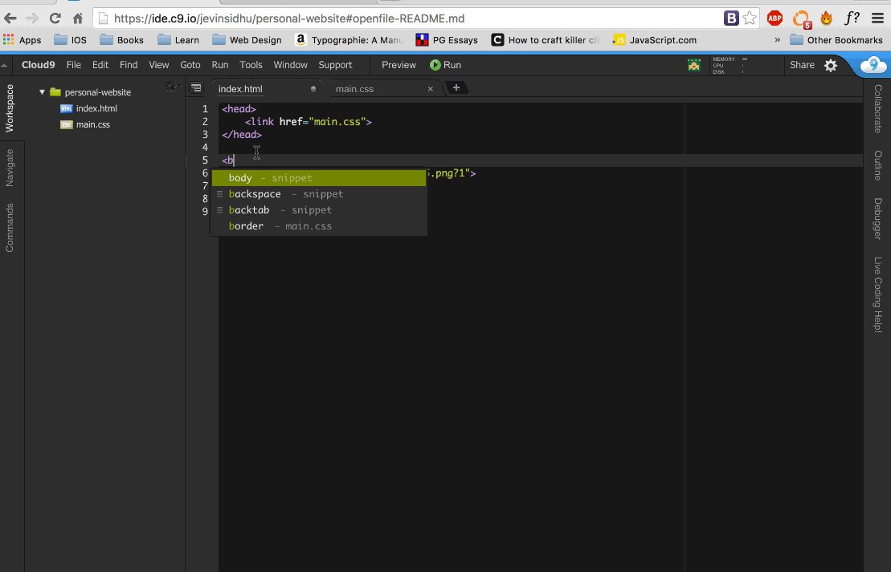

3. Now try indenting the code inside the `<head>` tag!

## Part Eighteen: Centre your Image + Text

1. Let’s center our picture and name inside the `<body>` tag

   Open the `main.css` file and using the previously learned `CSS selector`, select the `<body>` tag

2. Use the CSS property: `text-align` to control whether our objects are `left`, `center`, or `right-aligned`

   Images are considered “text" in this sense by HTML and so the property affects images as well.

3. Now use the CSS value: `center` -- to center the text → There is also **left** and **right** to align each way

   Code:

   ```
    body { 
     text-align: center; 
    } 
   ```

   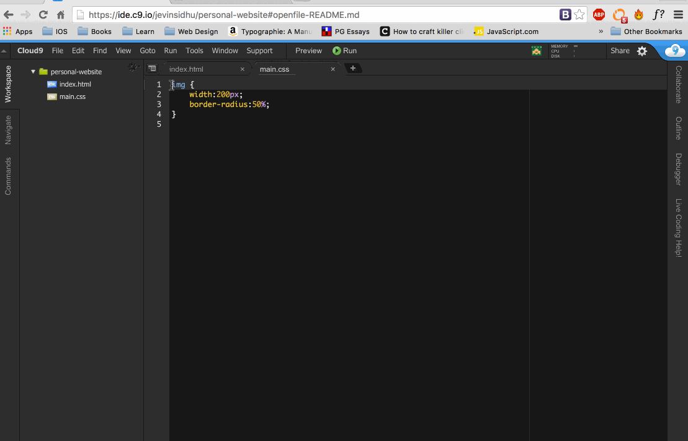

## Part Nineteen: Change your Background Colour

1. Let’s change that white to another colour!

2. Within the **CSS body selector** let’s declare another CSS property named `background-color`

   This does exactly what is sounds like: allows us to change the background color.

3. The CSS value for this property will be a colour

   Colours can be the name of the colour. I.e. grey, white, black, hot pink.

   Colours also have codes, known as hex codes → You need \# before the number. I.e. \#808080 = Grey + \#000 = Black + \#ffff = White.

   Black and white have only 3 digits, but most hex codes are 6 digits long.

   Code: `background-color: #HEXCODE;`

   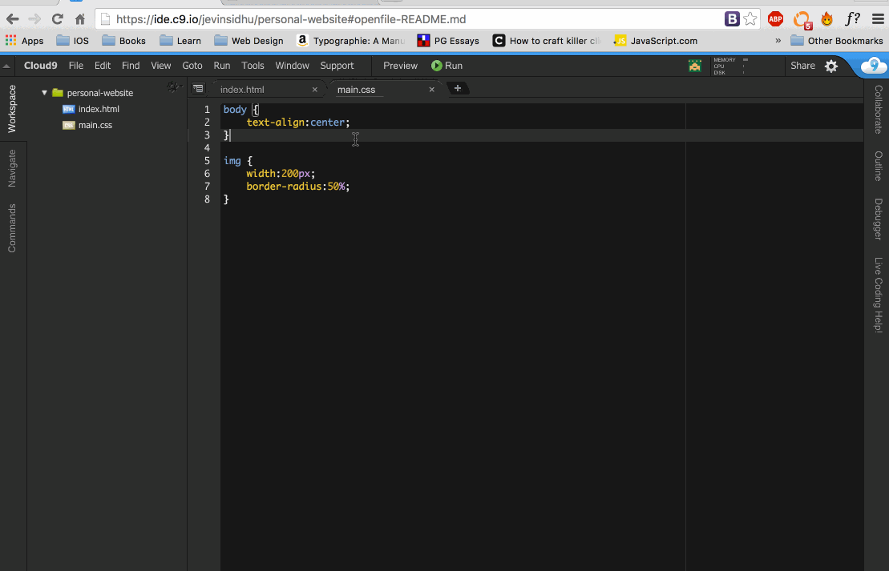

   Check out some beautiful colours here: [http://colorhunt.co/](http://colorhunt.co/)

## Part Twenty: Color the `<h1>` Tag

1. Let’s change the **color** of our `<h1>`** heading** as well

2. Create a **CSS selector** in our `main.css` file for `<h1>`

   ```
    h1 { 

    }
   ```

3. Use the CSS property, `color:` and CSS value \(hex-color\) `#fff` or `white`; to make it white

   This isn’t the `background-color`of the text, it is simply the `color` of the font

   It should look something like this:

   ```
    h1 { 
        color: #fff; 
    }
   ```

   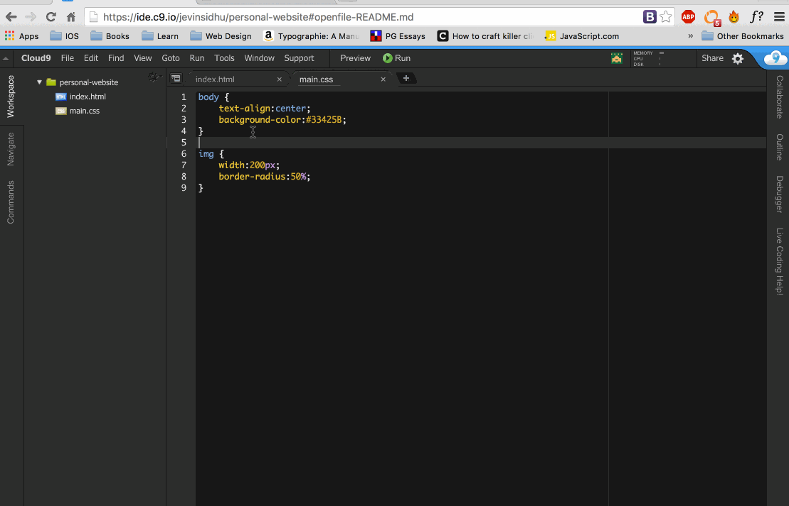

## Part Twenty-One: Intro to Margin & Padding

Let’s take a second to introduce two new concepts: margin and padding.

**Margin** clears an area around an element

* It’s completely transparent
* **Top, right, bottom, and left margin** can be changed independently using separate properties.

**Padding** clears an area around the content of an element inside the border

* It’s affected by the background color of the element.
* **Top, right, bottom, and left padding** can be changed independently using separate properties.

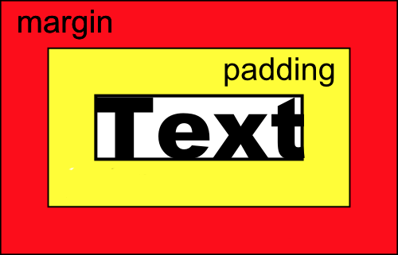

Example: You have a ring  and you’re putting it in a gift bag. The **area around the ring in the bag is padding**, the **area between the bag and your hand is margin.**

1. The picture and text are too close to the top of the webpage -- Let’s fix this.

   We need another **CSS property** called `margin` and **CSS value**: a `numerical value (percent or pixels)`

2. Let’s use the img tag → Therefore we must use the CSS `img selector`

   We use the `img` tag because that is the closest thing to the top

   If we move that, the text under it will move as well

3. We are using the `margin` but want to use specifically the top as the property → `margin-top: 250px;`

   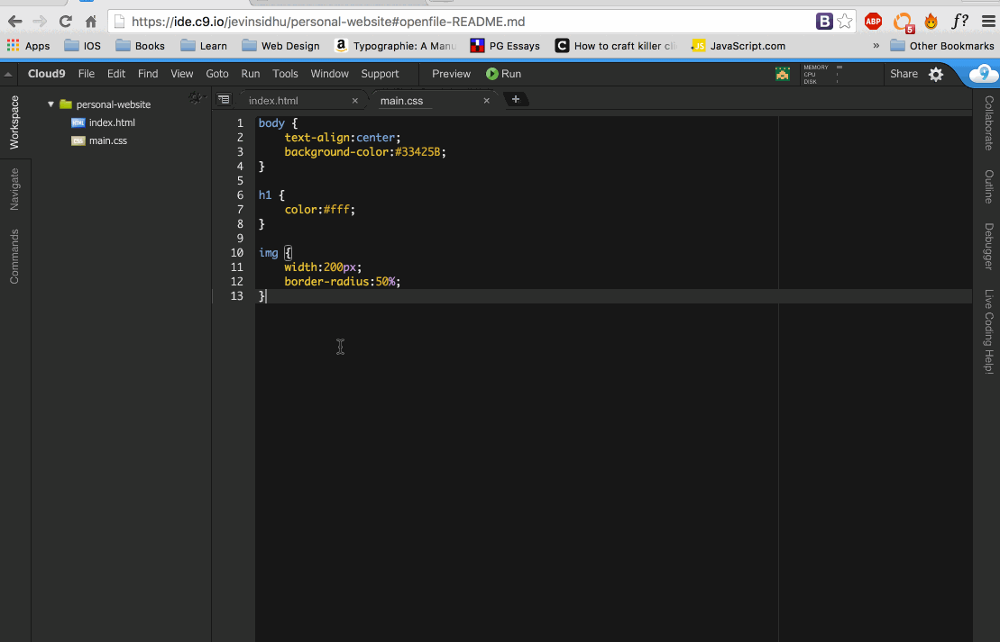

## Part Twenty-Two: The End

Congrats you finished building your website! **This is huge.**

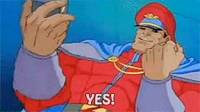

## Further Sections

1. [Project Section](PROJECT_SECTION.md)
2. [Custom Fonts with Google Fonts](GOOGLE_FONTS.md)
3. [Icons](ICONS.md)
4. [Bonus Ideas](BONUS_IDEAS.md)


