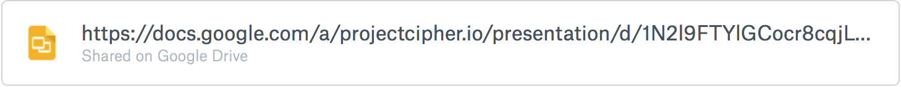

#Quadratic Calculator


##Introduction
#### What is a Quadratic Calculator?

**Quadratic Calculator** is an introduction to **numbers in JavaScript + if-else statements!**

Its a website that does the dreaded quadratic formula for you. Just enter the a, b and c values in the site and it will give back the x-intercepts.

We know how much you hate doing the quadratic formula in your calculator so why not it make easier!

This **slide deck created** by Amy Sorto and modified by **[Cipher](http://projectcipher.io/)** is a great introduction to key concepts. Take a look through it if you want to recap some of JavaScript basics.

[](https://docs.google.com/presentation/d/1N2l9FTYlGCocr8cqjLaHpp5tgv0hS-WI3US7PiMbRnc/edit#slide=id.p)

####Resources
Code:  https://ide.c9.io/uditdesai/quadratic-calculator

Final Webpage: http://uditdesai.github.io/quadratic-calculator

#Setting Up Your Files and HTML Document

1. Create an **index.html** file
2. Create a **main.css** file
3. Create a **script.js** file

Remember that the files do not have to be called “index” or “main” but these are usually what they are called. Just remember to make sure the file extensions are correct!

If setting up a document does not seem familiar, take a look at the Cringe 101 workshop

`<setup>`

This isn’t 100% necessary for the code to run, but it tells the webpage some **key facts** to make it **run smoothly.**

###Don’t copy and paste fam, put in the work!

```
<!DOCTYPE html>
<html>
  <head> 
    <link href="main.css" rel="stylesheet">
  </head>

  <body> 
  
    <script src="https://ajax.googleapis.com/ajax/libs/jquery/2.1.3/jquery.min.js"></script>
    <script src="script.js"> 
  </body>
</html>
```

**`<script src="script.js">`** **is linking the HTML file to the JS file**

- Webpages + browsers are really dumb, humans just make them smart
  
- `<script>` is a **self-enclosed tag** that links the the HTML file to the JavaScript file
  - **`src`** is called an **attribute**
    - It **specifies the location** — in this case it was simply the file name, “script.js”


####This is linking jQuery to your site!

```
<script src="https://ajax.googleapis.com/ajax/libs/jquery/2.1.3/jquery.min.js"></script>
```

As mentioned in the [slide deck](https://docs.google.com/presentation/d/1N2l9FTYlGCocr8cqjLaHpp5tgv0hS-WI3US7PiMbRnc/edit#slide=id.p),  **jQuery is a JavaScript library**.

- It adds functionality to the language, JavaScript.

Refer back to the [Thugify Workshop](https://paper.dropbox.com/doc/Thugify-Workshop-0IPrFN8Cfyr8kmgPTcOkg) for a **quick recap on jQuery!**


###Remember to always close your tags!


    <h1> Don't Forget! </h1>

`<setup/>`
##Creating the HTML Structure

Our focus on this workshop is with JavaScript, so lets get the HTML finished first!


**Note: All of the HTML content must go in the `<body>` tags on top of the code we wrote to link the JavaScript files!**


##Let’s get it

###**1. To enclose our content, we’ll create a `<div>` tag!**

This creates a container which allows us to

- Organize the content of the site
- Add styling to everything enclosed


    <div class="calculator">
    
    </div>

###**2. To add the name of the workshop, let’s create a `<h1>` tag!**

Remember to **indent your code!** It may not be a big deal at the moment but when there’s multiple lines of code, it makes it **A LOT easier to read.**


    <div class="calculator">
      <h1> Quadratic Calculator </h1>
    </div>
    
###**3. Lets create a place where you can enter your a, b and c values of the quadratic equation using the self - closing `<input>` tag!**


`<input>` is a **self-enclosed tag** for creating an **input box.** We’ll be able to type in this box!


We’ll need to create **3 input boxes** as you’ll need to input **3 different values**

**Give each input box an id being `“avalue”, “bvalue” and “cvalue”`**

It should look something like this:

    <input id="avalue" >
    <input id="bvalue">
    <input id="cvalue">


- An id is a way to identify single elements that use the same tag as other elements


- I.e. There are multiple `<input>` tags in your code
    -  To select one it needs to have its custom name, thus the id

We can give the box **`“placeholder text”`** as well! 

- Placeholder text in the greyed out text (see the photo above, “insert text”)

Add a **`placeholder` attribute** (like `src` is an attribute):

-  **`placeholder="some text"`** right after the id 


    <input id="avalue" placeholder="a value?" >
    <input id="bvalue" placeholder="b value?" >
    <input id="cvalue" placeholder="c value?" >

I made the placeholder text  `“a value?”` **, you can make it whatever you like!**

###**4. We need to make submit button with the `<button>` tag!**

`<button>` is the tag for creating a button

- Just like the `<h1>` tag, this another tag where we place text between the opening and closing tags to display on the webpage

Give this button **whatever text you’d like,** be creative!


    <button> easy </button>

Give this button the **id `“submit”`**


    <button id="submit"> easy </button>

we’re going to tell the webpage  that this is of **type-something**

  - In this case, it’s a **button!**
  
- To do this, we’re also going to give this a **`type` attribute**


-  **`type="button"`** right before the id 
  - This is to ensure that the webpage understands we want a button
    - By specifying this, the HTML adds some build-in CSS styling

##The Code so far! DON’T COPY AND PASTE


        <div class="calculator">
          <h1> Quadratic Calculator </h1>
  
          <input id="avalue" placeholder="a value?">
          <input id="bvalue" placeholder="b value?">
          <input id="cvalue" placeholder="c value?">
  
          <button type="button" id="submit"> easy </button>
        </div>

###**5. To create space for x-intercepts to be given back, lets create a `<p>` tag!**

`<p>` stands for paragraph

- Just like the `<h1>` tag, this another tag where we place text between the opening and closing tags to display on the webpage

We’ll need to create** 2 `<p>` tags** as there can be **2 x-intercepts** in quadratic equations.

Give both of the tags an **`id`** being **`xvaluefirst`** and **`xvaluesecond`** respectively!


    <p id="xvaluefirst"> </p>
    <p id="xvaluesecond"> </p>

The **x-intercepts will be found** using the values submitted in the input boxes

- We will then add the x - intercept values between the opening and closing `<p>` tags 
  - **We’ll do this using JavaScript**


##Final Code (Drake wouldn’t copy and paste) ←  he uses ghost writers 

```
 <body>
    
    <!-- Our main HTML -->
      <div class="calculator">
        <h1> Quadratic Calculator </h1>
        
        <input id="avalue" placeholder="a value?">
        <input id="bvalue" placeholder="b value?">
        <input id="cvalue" placeholder="c value?">
        
        <button type="button"> id="submit"> easy </button>
        
        <p id="xvaluefirst"> </p>
        <p id="xvaluesecond"> </p>
      </div>
      
    <!-- Our JavaScript files, also referred to as simply "scripts" -->  
      <script src="https://ajax.googleapis.com/ajax/libs/jquery/2.1.3/jquery.min.js"></script>
      <script src="script.js"> 
    </body>
```
    

#CSS

**CSS** (cascading style sheets) is the **styling** of our page

- This styling lives in the **main.css** file


We use selectors in CSS that select our HTML tags

We want **you** to style the page! 

- If you feel uncomfortable, that’s good! Being put out of your comfort zone is one of the best ways to grow. Embrace your creativity and think of a design that’s beautiful and easy to use. 


- Your peers are **here to help you** if you have any questions, **all you gotta do is ask**
  - **Google** is also amazing! It’s what ***all programmers*** turn to, especially **professionals**! 

If you feel completely lost, no worries! Go back to our older workshops and work skim through those (linked at the top of this document).

A great resource to find pretty colors to use on the site can be found here: http://colorhunt.co/

##May the (Design) Force be with you


#Javascript!


Remember that the variable names in the examples below can be **anything** you want, but we recommend sticking with ours in order to make the workshop easier to follow! 

- Remember to always make variable names clear and descriptive
- Remember to use camel spacing — first word lowercase and every word after starts with an uppercase (thisIsAnExample)


###**1. Adding a Listener (remember from thugify)**

To begin all our code in JavaScript, we’ll need to start by adding a **listener** to listen for a click on the easy **button** (submit button)


    document.getElementById("submit")

This basically means: find the element in document (html) with the id `“submit”`

- `“getElementById”` is an example of **camel casing** which is **conventional** in JavaScript

Now we’ve found the element, but we haven’t done anything with it. To make the button actually trigger some code, we’ll add `.onclick = function() {}` to the end of the line.

 `.onclick = function() {}`  simply means that on the **click** on the element or button do this **function**.
 
 To review, so far the code is


    document.getElementById("submit").onclick = function() {}

 
This translates to: find the element with the id `“submit”` and when the element is clicked, run the function.

**Note: the code which is the actual function should go inside the curly brackets { code }**


###2. Assigning Variables

First things first, we need to **store** the **data** we get from the **input boxes**!

We’ll need to create **variables** for this

**Reminder from [Slidedeck](https://docs.google.com/presentation/d/1N2l9FTYlGCocr8cqjLaHpp5tgv0hS-WI3US7PiMbRnc/edit#slide=id.gd76540ddf_0_22): When creating variables (var), whatever is on the right side, is always being assigned to the left side .**

- I.e. The content on the right is going to be assigned to the variable `a` on the left

We’ll be grabbing the values **(remember there were 3 input boxes)** from the input box with the id’s of `“avalue”, “bvalue”, and “cvalue”`

- whatever number someone types in the input box will be retrieved and put into the variable with this line of code below:


    var a = $("#avalue").val();
    var b = $("#bvalue").val();
    var c = $("#cvalue").val();

Remember the **`$`** is the **power of jquery** at work which made a longer line of code shorter

- `document.getElementById` turned into`$`

Remember `.val();` means the value of the var will be everything in front of the `.`

#####To clarify everything


    var a = $("#avalue").val();

Means to take the **value of** the element **`avalue`** and **store it into a new variable** called **`a`**

Right now, the whatever value you input and the JavaScript now collects is a **string** value (refer to the [slidedeck](https://docs.google.com/presentation/d/1N2l9FTYlGCocr8cqjLaHpp5tgv0hS-WI3US7PiMbRnc/edit#slide=id.gd76540ddf_0_22)). We **need** the value to be a **number**!

**Note: Review the difference between a string and number using the [slidedeck](https://docs.google.com/presentation/d/1N2l9FTYlGCocr8cqjLaHpp5tgv0hS-WI3US7PiMbRnc/edit#slide=id.gd76540ddf_0_22)!**


###3. Convert the String Value in the Variables to a Number Value

To do this we’ll use a JavaScript **function**.

- A function is basically a block of code which completes a task (in this case, converting a string into a number)

**You can Google what a function is really easily! Try it next time because the definition up there is straight from Google.**

The **function** we’ll use to turn the string value into a number is **`parseFloat()`**

- Float means a floating-point number or a number with a  fractional part (E.g. 1.0, 3.33)

We’ll use this function to turn the string values in the variables into numbers:


    a = parseFloat(a);
    b = parseFloat(b);
    c = parseFloat(c);

**Inside the brackets** of the function is where you **insert** the **value** you want to apply the function to. 

- In this case the value is a variable because we stored the information inside the variable to make our lives easier

Note: I did not create new variables to store these numbers in but just changed the old ones. Since I only changed the old ones, I didn’t have to write `var a =` but only `a =` as it is already stated that `a` is a variable.

similar to `parseFloat()` there is also `parseInt()`, both serve a similar purpose but the latter is used for integers only.


- There’s **2 types of numbers** in JavaScript: 
  - **integers** (eg. 5, -10, 100)
  - **floating point numbers** (eg. 5.67, 0.0009, -67)
  
- When you want to keep the decimals, use `parseFloat()`

**Your code so far should be similar to this (ISN’T THE INDENTING PRETTY?)**


    document.getElementById("submit").onclick = function() {
    
        var a = $("#avalue").val();
        var b = $("#bvalue").val();
        var c = $("#cvalue").val();
        
        a = parseFloat(a);
        b = parseFloat(b);
        c = parseFloat(c);
        
    }

Now it times for the math, don’t worry though, we don’t have to do any calculations!


###4. MATH

Math in JavaScript is quite similar to doing math in real life. 

- **Both follow the rule of BEDMAS**

This will come in handy when we need to do several steps in 1 line of code, It doesn’t get too complex here though!

Before we get started, here are the four basic operations in JavaScript:

**Addition → `+` 
Subtraction →`-`
Multiplication → `*`
Division → `/`**

More complicated operations can be done using a **math object**, which we’ll do in a bit

**Note: negative numbers in JavaScript are written the same way (e.g. -4, -15).**

To review really quickly, the quadratic formula is:


####1. Square Root

First we’ll deal with the terms inside the square root!

Create a **variable** named **`insideSquareRoot`** and make it equal to the right hand side of the square root (-4ac) 

We’re only multiplying the right hand side atm to keep the code short and less complicated, we’ll add the left hand side right after!


    var insideSquareRoot = (a * c * -4);

The code states that the **variable** named `insideSquareRoot` **stores** the **product of a,c and -4**. Exactly like normal math, we multiplied the 3 terms to acquire the value. 

The brackets in that code are not necessary, but they help keep the code organized. The order of the terms do not matter either

**Note: you can use variables instead of a number value as variables store the number value **

Remember how we can update a variable without stating it is a variable again, that’s what we’ll do to add the left hand side of the square root onto the variable.

Update the `insideSquareRoot` variable by adding b² to the -4ac

    insideSquareRoot = (Math.pow(b, 2) + insideSquareRoot);
    
##WOH, WHAT’S THAT CODE IN THE MIDDLE?

Math operations such as exponents and square roots are a bit more complex than simple operations and need the use of **Math objects** to use them.

Math objects are blocks of code **designated to complete various math operations**. Google them to find a ton of them which you can use in the future. 

Right now we’ll be using the math object which lets us use exponents which is:


    Math.pow(x, y)

**`Math.pow()`** is the math object and **inside the brackets** you would **state the base of the term followed by a comma and then the exponent of the term**. In this case, the x is the base and the y is the exponent.

In our code, the variable `b` was the base and the exponent was 2 so the code was:


    Math.pow(b, 2)

The full line of code basically means update the variable `insideSquareRoot` to store the current value inside the variable plus b².


    insideSquareRoot = (Math.pow(b, 2) + insideSquareRoot);

Now we actually have to square the contents of the square root!

This will also use a math object:


    Math.sqrt()

This **math object** basically states that it will **square root the value in the brackets**. In our case that value will be the contents inside the square root or the variable `insideSquareRoot`

Create a new variable named `squareRoot` and store the square root of the variable `insideSquareRoot` in it.


    var squareRoot = (Math.sqrt(insideSquareRoot));

The final code for the whole square root part of the quadratic formula should look like this:


    var insideSquareRoot = (a * c * -4);
    insideSquareRoot = (Math.pow(b, 2) + insideSquareRoot);
    var squareRoot = (Math.sqrt(insideSquareRoot));


####2. -b value

Now we’ll worry about what’s outside the square root, and the first thing outside of it is the -b value!

This code is quite simple as we just have the make the value inside the variable `b` negative. An easy way to do that is to just **subtract the value from 0** making the new value negative!

 Create a new variable named `negativeBValue` and make it store the value of 0 - b in it
 

    var negativeBValue = (0 - b);
    
**Remember to make all your variable names with camelCasing**


####3. Denominator

Before we start adding and subtracting the numerator, let’s quickly create a **variable** to **hold** our **denominator** which is constant.

Create a variable named `denominator` and store the product of 2 and a in it (denominator of quadratic formula is 2a)


    var denominator = (2 * a);

The tricky parts are about to come as we’ll have to branch off after this since in the numerator you can either add or subtract! Before that, here’s our JavaScript file so far!


    document.getElementById("submit").onclick = function() {
        
        var a = $("#avalue").val();
        var b = $("#bvalue").val();
        var c = $("#cvalue").val();
        
        a = parseFloat(a);
        b = parseFloat(b);
        c = parseFloat(c);
        
        var insideSquareRoot = (a * c * -4);
        insideSquareRoot = (Math.pow(b, 2) + insideSquareRoot);
        var squareRoot = (Math.sqrt(insideSquareRoot));
    
        var negativeBValue = (0 - b);
        var denominator = (2 * a);
    };

Now it’s time to **branch off** as the **quadratic formula can return 2 different values.**


####4. If we add in the Numerator

Create a new variable named `numeratorPlus` and store the sum of the variable `negativeBValue`  and the variable `squareRoot` in it


    var numeratorPlus = (negativeBValue + squareRoot);
    
Now that we’ve got a value for the numerator and we already have a denominator, let’s write some code to get an answer!

Create a new variable named `answerPlus` which stores the quotient of the variable `numeratorPlus` and the variable `denominator`


    var answerPlus = (numeratorPlus / denominator);

**YAY! WE HAVE ONE ANSWER NOW!**


####5. If we subtract in the Numerator

Now we have to do the same thing as we did when we added in the numerator but this time we’ll subtract

Create a new variable named `numeratorNegative` and store the difference of the variable `negativeBValue`  and the variable `squareRoot` in it


    var numeratorNegative = (negativeBValue - squareRoot);

Now we have the numerator and the denominator values, let get the second answer!

Create a new variable named `answerNegative` which stores the quotient of the variable `numeratorNegative` and the variable `denominator`


    var answerNegative = (numeratorNegative / denominator);

WE DID IT, WE GOT 2 ANSWERS!


###5. Final Answers

We’ve done all the math to acquire our two answers now, but right now, they will just come back as the number. We need them to come back as `x = _`

To do this, we’ll create new variables which will store a string plus the numbers we get as our answers.

Create a new variable named `finalAnswerPlus` and make it store the string: 

-  `x =` plus the answer that is in the variable `answerPlus`


    var finalAnswerPlus = ("x = " + answerPlus);

This line of code states that in the new variable `finalAnswerPlus` , store the string `x =` followed with the information in the variable `answerPlus`

**Challenge: Do the same thing but this time for our second answer (Call the new variable `finalAnswerNegative` to make the workshop easier to follow**


###6. If Else Statements

Now we want the page to spit out our answers, however the **problem** is that sometimes the **quadratic formula** will give you **no answers** usually because the value inside the square root is a negative.

In this case, JavaScript would return **`NaN`, which stands for Not-a-Number.**

We don’t want our code to say `NaN`, so we’ll have to use **If Else statements** to tell the computer to only **return our answers** if there is actually a **number value** in them!

**If Else statements are conditional statements. **

They are as simple as — if this is true, do this. Else, do this

- eg. If I score a point, add 1 to my score. Else, do nothing.
- eg. If the value is `NaN`, say no answer. Else, say the number value.

This is how an If Else statement looks like:


    if () {
    
    } else {
    
    }

The conditional statement starts with the **keyword `if`** similar to `var` when creating a variable.

It then has parentheses, inside the parentheses will go the condition which is basically a simple test whose answer would true or false. 

Following with braces. Inside the braces you would enter the code which runs if the condition in the parentheses is true.

Instead of ending the code with a semicolon after the second brace, it adds an else keyword. The else keyword is followed with braces. Inside the braces, would be the code which runs if the condition in the parenthesis was false.

Look at the slide deck for more info on If Else statements!

Lets start writing our own code!


####1. Create an If Else statement like the one we looked at above in our JavaScript file.


    if () {
    
    } else {
    
    }

####2. Condition

Now we need to add our condition. The reason we need a conditional statement is because the quadratic formula may not always give us an answer. 

Our condition will ask whether or not the value inside the two answer variables is `NaN`, if that is true, the website will say `no answer 😞`

In the parenthesis, add this function like this:


    if ( isNaN(answerPlus, answerNegative) ) {

This code uses the **function `isNaN()**` 

This **function** basically just **checks** whether the **value** inside the brackets of the function is **`NaN`** or not — doesn’t that makes our lives a lot easier!

Now, if the **value inside both answer variables is `NaN`**, the computer will **give back something different**. If the **value in the answer variables is a number**, then it will **work normally!**


####3. Displaying the Text

Now we need to display our message! **We’ll add all this code inside the braces for our if statement**

We’re going to use: `document.getElementById()` to find an element on the HTML page by it’s id


    document.getElementById("xvaluefirst")

In this line of code, we’re finding the element with the id of `xvaluefirst`

**PS:** you can use jQuery’s `$(‘’)` for this as well since there’s practically no downside.

- Try changing this line to use the jQuery syntax
  - Syntax means the grammar, spelling and set of rules of a language  

Now then, we will attach  `.innerHTML = ``“no answer 😞”` to the end of the line


    document.getElementById("xvaluefirst").innerHTML = "no answer :(";

  `document.getElementById('``xvaluefirst``').innerHTML = ``“no answer 😞”``;` means: 

- Set the `innerHTML` of `“#``xvaluefirst``”` to the value of the **string,** `”no answer 😞”` 

So far, your code for the if else statement should probably look something like this!


    if ( isNaN(answerPlus, answerNegative) ) {
      document.getElementById("xvaluefirst").innerHTML = "no answer :(";
    } else {
    
    }

In our html, we also had a second `<p>` tag as a quadratic formula gives out two possible answers. Since, we’re currently dealing with when there are no answers, let’s do the same for that element `xvaluesecond` like we did for `xvaluefirst`

**Challenge: under the code you wrote to display “no answer 😞” write a line of code which finds the element with the id of `xvaluesecond` and sets the `innerHTML` of it to be a string with nothing it to return nothing to the screen!**


####4. Displaying the Answers

Now that we’ve dealt with the possibility of no answers and displaying text for those, displaying the answers will be a piece of cake!

In the **braces of the Else Keyword**, we’ll write the **code which displays our answers** as we only want our answers to display if they are actually numbers (meaning that the test of whether they were `NaN` or not was false)

**Challenge: Use the same code you wrote when the answer was `NaN` to display the string `no answer 😞` and the string with no characters in it to display the answers. **

- Hint: instead of setting the  `innerHTML`  to be a string value, just place the variables with the final answers in them!

#Final JavaScript Code (DON’T COPY AND PASTE)


    document.getElementById("submit").onclick = function() {
        
        var a = $("#avalue").val();
        var b = $("#bvalue").val();
        var c = $("#cvalue").val();
        
        a = parseFloat(a);
        b = parseFloat(b);
        c = parseFloat(c);
        
        var insideSquareRoot = (a * c * -4);
        insideSquareRoot = (Math.pow(b, 2) + insideSquareRoot);
        var squareRoot = (Math.sqrt(insideSquareRoot));
    
        var negativeBValue = (0 - b);
        
        var denominator = (2 * a);
    
        var numeratorPlus = (negativeBValue + squareRoot);
        var answerPlus = (numeratorPlus / denominator);
        
        var numeratorNegative = (negativeBValue - squareRoot);
        var answerNegative = (numeratorNegative / denominator);
        
        var finalAnswerPlus = ("x = " + answerPlus);
        var finalAnswerNegative = ("x = " + answerNegative);
        
        if ( isNaN(answerPlus, answerNegative) ) {  
            document.getElementById("xvaluefirst").innerHTML = "no answer :(";
            document.getElementById("xvaluesecond").innerHTML = "";
        } else {
            document.getElementById("xvaluefirst").innerHTML = finalAnswerPlus;
            document.getElementById("xvaluesecond").innerHTML = finalAnswerNegative;
        }
        
 #YOU ARE NOW A JAVASCRIPT MATHEMATICIAN FAM
 
 

