# Workspace Setup

*Time Estimate: 10-15 minutes*

This guide will take us through the setup process of our workspace!

The workspace consists of two tools: [GitHub](#) and [Cloud 9](#). These crucial tools are required to take advantage of the rest of Cipher's guides.

Note: When you see: **[GIF]**, this means the image below is a GIF -- a looping video!

## Table of Contents

1. [GitHub](#github)
2. [Cloud 9](#cloud-9)

## Part I: Creating Accounts

Let's create a [GitHub](#) and [Cloud 9](#) account!

### 1) Signing Up for a GitHub Account

Good news! This is a super easy process that wouldn't take too long.

#### 1. Navigate to https://github.com

  

#### 2. Sign up through the form

  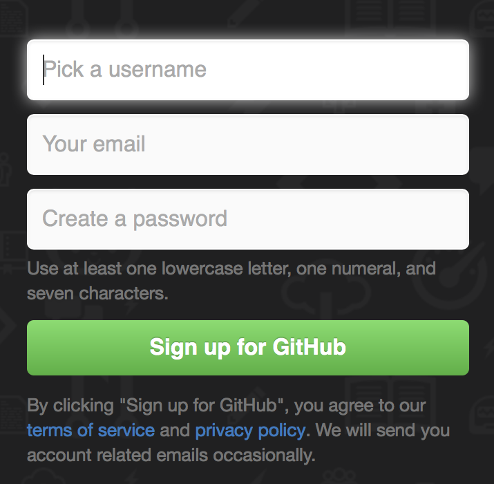

#### 3. Navigate to account settings

  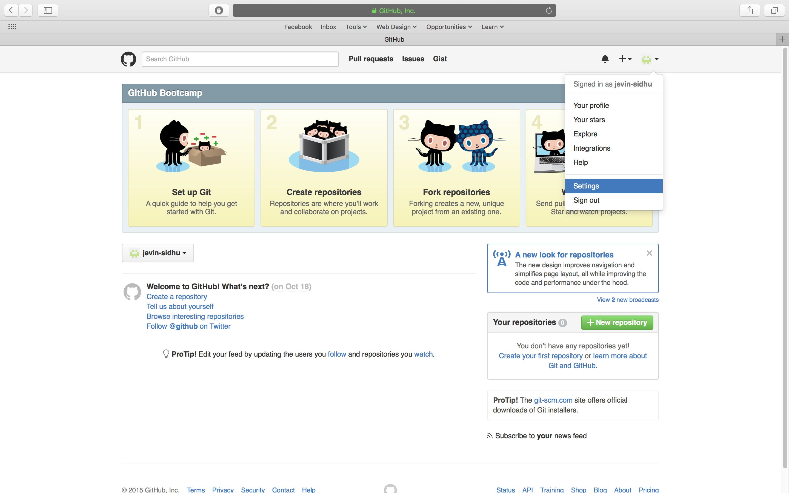

#### 4. Add your name and a picture, then click "Update profile"

  

#### 5. Check the inbox of the email you registered with and verify your email address

  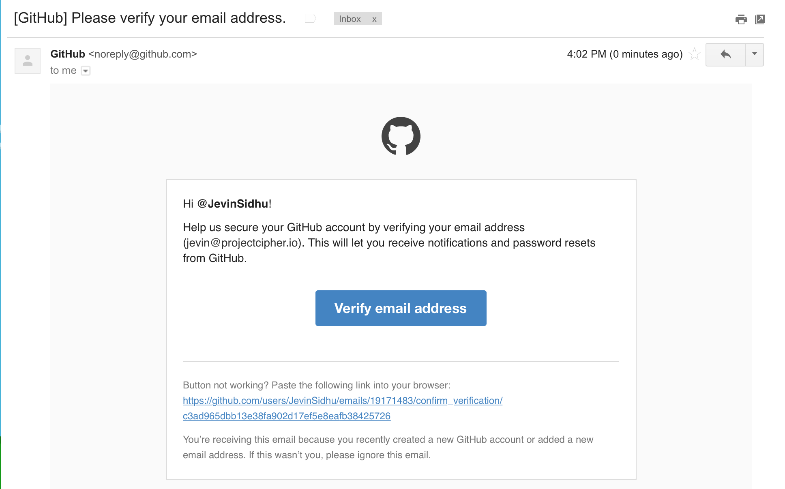

### 2) Signing Up for a Cloud 9 Account

This process is even faster than GitHub's because C9 allows you to sign in with your GitHub account!

#### 1. Navigate to http://c9.io

  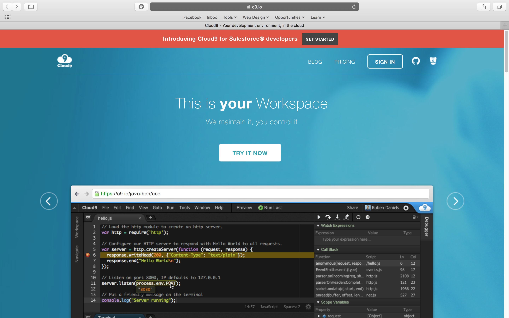

#### 2. Log in using your GitHub account

Click the GitHub button at the top-right of the page. It looks like this: .

Then enter your GitHub email address and password to sign in!

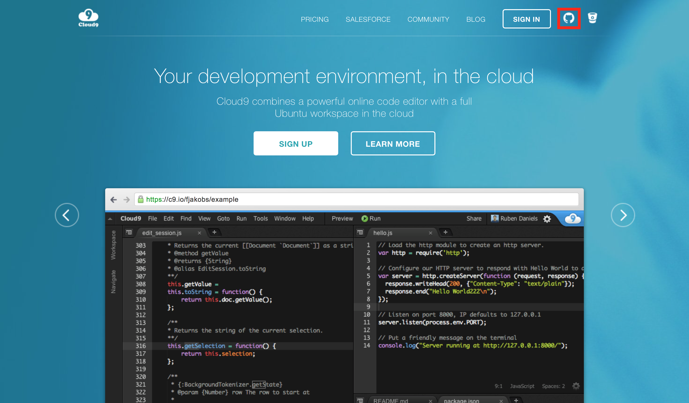

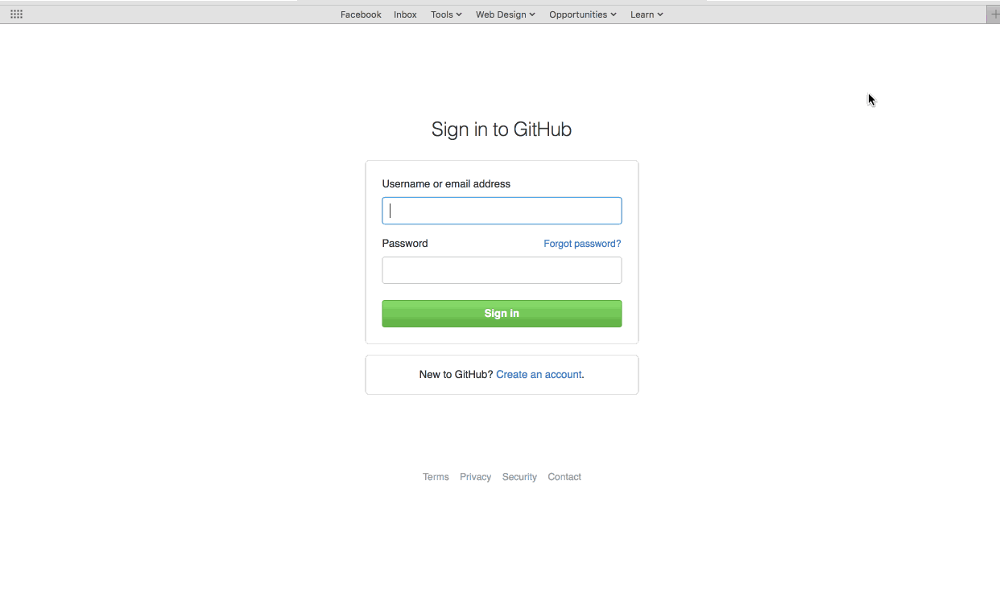

#### 3. If C9 asks you for payment info
Use these credientials:

| Cardholder Name | Card Number | Expiry Date | CVV |
| -- | -- | -- | -- |
| Project Cipher | 5113 4026 7731 5930 | 08/20 | 555 |

It's a empty prepaid credit card, so dont try nothin fancy.

#### 4. You should be taken to a screen that looks like this:

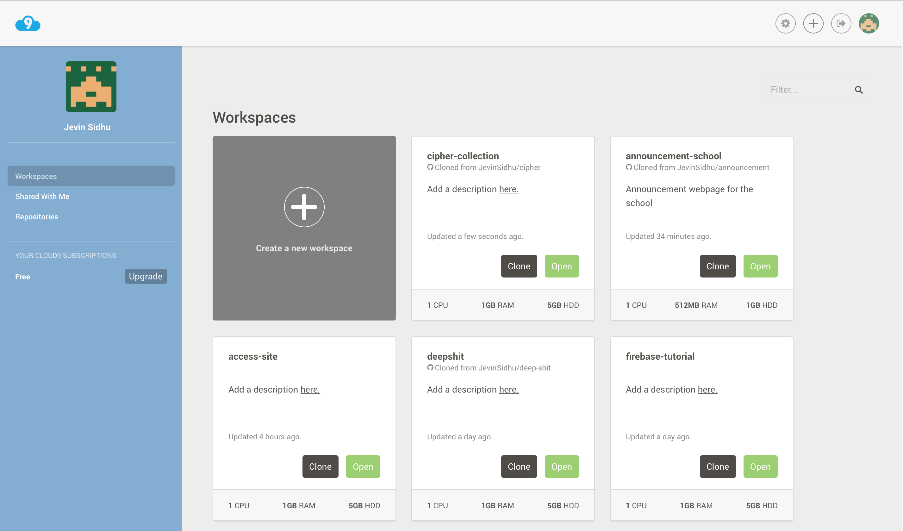

**Keep this tab open!**

> If you receive some sort of error, ask the person next to you for some help! If that doesn't help, ask the facilitator for help.

### 5) Celebrate!

We made it! We just have a few more steps to finish our set-up.

## Part II: Creating a C9 Workspace

### 1) Create a GitHub Repository

We've already created a [GitHub](#) account, so let's put it to use!

1. Go to https://github.com -- make sure you're signed in

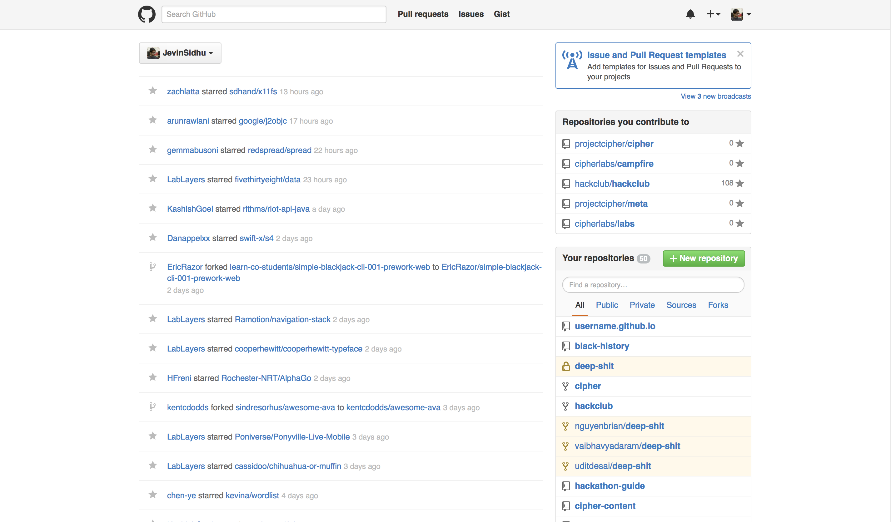

2. Click the green **"+ New repository"** button on the right side of the page

3. Under "Repository name" write your USERNAME.github.io

Note: instead of writing USERNAME, write your GitHub username. This is stated under "Owner".

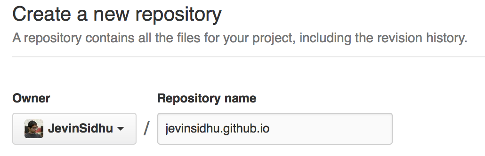

- For example, my username is jevinsidhu, so I would write jevinsidhu.github.io.

4. Click the green "Create repository" button at the bottom.

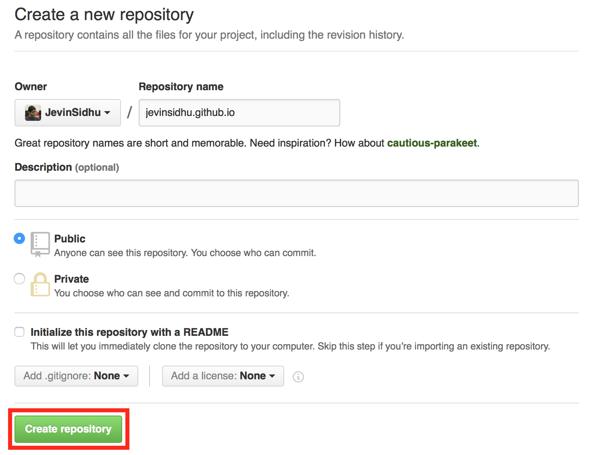

5. You will be taken to a new page. There, copy the "HTTPS link" at the top. You will need this for the next step!

Note: it should look like this: `https://github.com/username/username.github.io.git`.

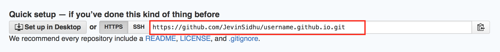

### 2) Create a C9 Workspace

We've also already created a [C9](#) account, so let's put that to use.

Head back to the tab you left open -- if you closed it, just go to https://c9.io.

We will need to create a "workspace" to have a place to write our code!

1. Click "Create a new workspace"

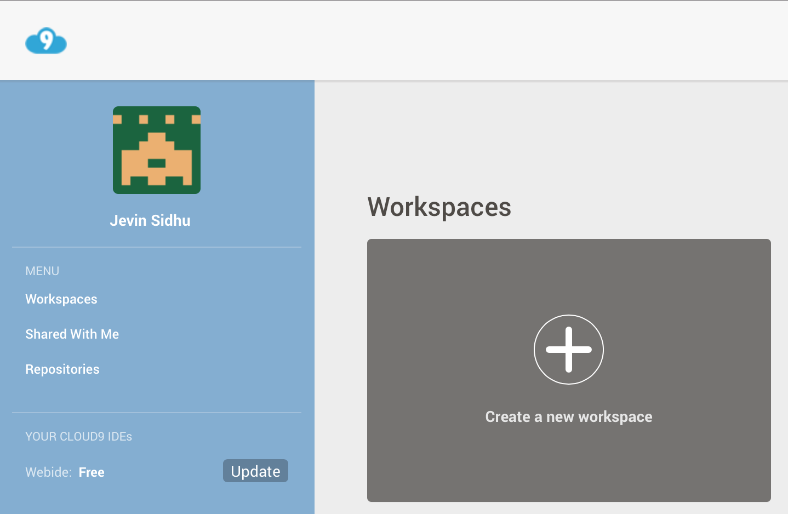

2. Fill in "Workspace name" with the name "cipher-projects"

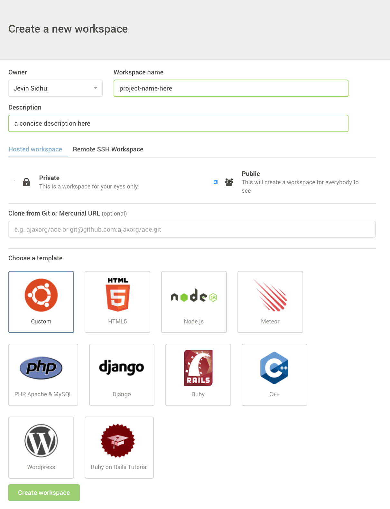

3. Under "Clone from Git or Mercurial URL", paste the HTTPS link that you copied from the GitHub page.

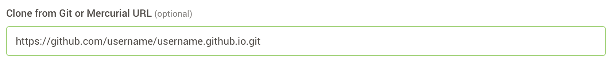

4. Without changing anything else, scroll to the bottom and click the green "Create Workspace" button

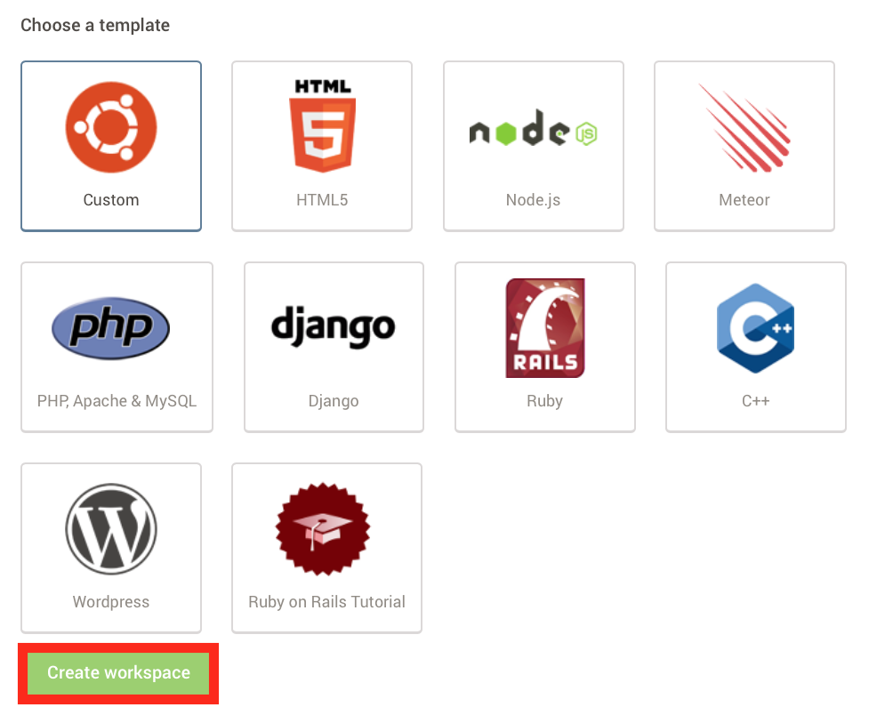

5. You should be welcome by a screen similar to this!

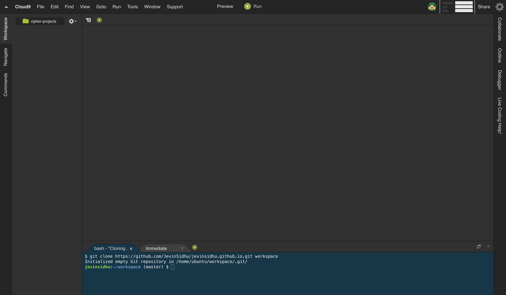

> If are having some trouble, ask the person closest to you for help! If they cannot offer some help, ask your facilitators.

### 3) Celebrate!

## Closing

Congrats! You're setup with the tools to tackle our upcoming guides.

Be sure to check out [`DOCUMENTATION`](../DOCUMENTATION.md)for extended explanations, examples, and practice on the content covered here.

Tweet us [@projectcipher](https://twitter.com/projectcipher) telling us how awesome you are for completing this!

Constantly making this guide better is our priority, and you can help! If you found any problems or think something can be done better, [open an issue](https://github.com/projectcipher/cipher/issues/new). You could also read [`CONTRIBUTING`](../../CONTRIBUTING.md) if you want to add something yourself!

