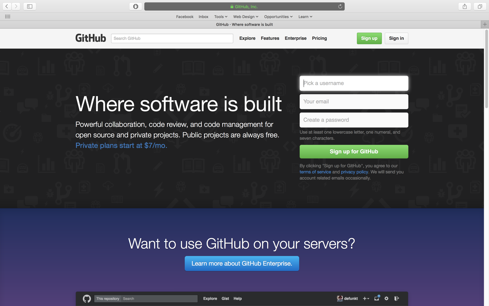
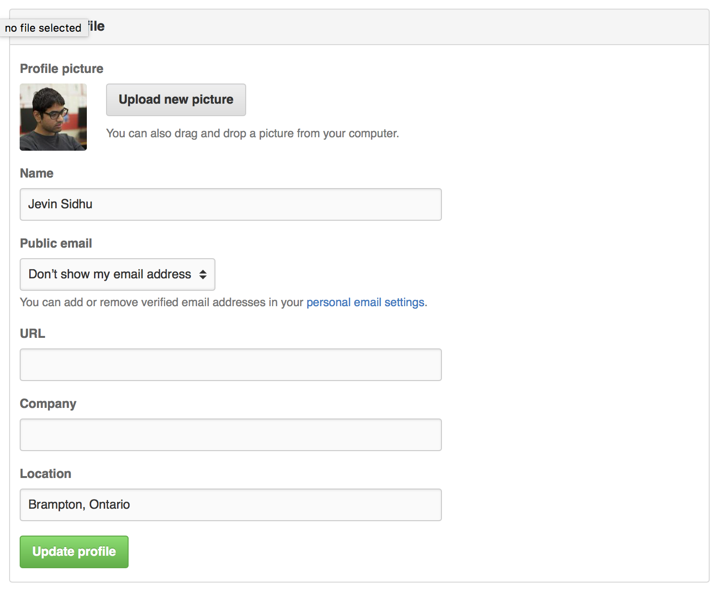

# Workspace Setup

This guide will take you through the setup of two crucial tools that we need in order to take advantage of the rest of Cipher's guides.

## Introduction

All of the guides will require the use of a workspace! The workspace consists of leveraging two tools:

- [Git + GitHub](#git--github)
- [Cloud 9](#cloud-9-c9)

## Git + GitHub

These two work in conjunction to allow our content to be posted online. This will enable the creation of custom web addresses/URLs for our projects, which will be sharable with friends and family!

### What is Git?

[Git](https://git.com) is a [version control system](../DOCUMENTATION.md#version-control-system-vcs).

### What is GitHub?

[GitHub](https://github.com/) is a [repository](../DOCUMENTATION.md#repository) hosting service. It provides a friendly way to manage [repositories](../DOCUMENTATION.md#repository) and [branches](../DOCUMENTATION.md#branch) with an organized interface).

### How to Sign Up for a Github Account

Good news! This is a super easy process that wouldn't take too long.

#### 1. Navigate to https://github.com

  

#### 2. Sign up via the form

  

#### 3. Navigate to account settings

  

#### 4. Fill in relevant information and click "Update profile"

  

#### 5. Check the inbox of the email you registered with and verify your email address

  

## Cloud 9 (C9)

This tool will enable us to write code in an appropriate enviroment.

### What is C9?

C9 is an online text editor that has tools to help you code more efficiently. The technical term for this is [integrated development environment](../DOCUMENTATION.md#integrated-development-environment-ide).

Part of what makes C9 great is that it enables you to start programming with simply the internet and a browser. No installing software required!

### How to Sign Up for a C9 Account

This process is even faster than GitHub's because Cloud 9, _also known as C9,_ allows you to sign in via your GitHub account!

#### 1. Navigate to http://c9.io

  

#### 2. Log in using your GitHub account

#### 3. Get familiar with creating workspaces

Workspaces are where we will write our code! It is important to know how to create these workspaces. Don't worry though, it's very straight-forward!

1. Simply click "Create a new workspace"

2. Fill in "Workspace name" and "Description". The rest of the settings are fine!

3. Click the green "Create Workspace" button at the bottom of the page.

#### 4. Delete default files

C9 generates one file by default when we create a workspace. This file is a [markdown file](../DOCUMENTATION.md#markdown).

We don’t need this file, so let's delete it:

  1. Right click the file, “README.md”, from the left bar
    - The left bar is called the "directory"
  2. Click “Delete” on the pop-up menu
  3. Click “Yes” on the dialog box to confirm your deletion
  4. Near the top of the page, click the "x" on the tab named "README.MD" to close the document

## Closing

Congrats! You're setup with the tools and knowledge to tackle our upcoming guides.

Be sure to check out [`DOCUMENTATION`](../DOCUMENTATION.md)for extended explanations, examples and practice on the content covered here.

Tweet us [@projectcipher](https://twitter.com/projectcipher) telling us how awesome you are for completing this!

Constantly making this guide better is our priority, and you can help! If you found any problems or think something can be done better, [open an issue](https://github.com/projectcipher/cipher/issues/new). You could even read [`CONTRIBUTING`](../../CONTRIBUTING.md) if you want to add something yourself!

